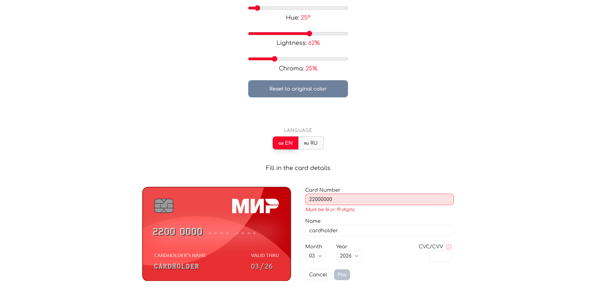

> **Live Demo:** [https://bankcard3d.vercel.app](https://bankcard3d.vercel.app)

# 💳 Interactive 3D Bank Card Component (React + OKLCH)



A high-end, interactive 3D bank card component with real-time color customization and multi-language support. Built with performance and modern CSS in mind.

[Live Demo on Vercel](https://bankcard3d.vercel.app) 🚀

---

## ✨ Features

- **🔄 Realistic 3D Flip:** Smooth 700ms transition between front and back sides triggered by form focus (e.g., CVC field).
- **🎨 OKLCH Dynamic Theming:** Real-time lightness, chroma, and hue adjustment via sliders. Derivative colors (Light/Dark) are calculated automatically.
- **🌍 Multi-language Support:** Instant toggle between English and Russian, including real-time error message translation.
- **✅ Robust Validation:** Powered by **TanStack Form** and **Zod** for type-safe, instant feedback.
- **🔊 Sound Design:** Subtle audio feedback ("ticks") on slider adjustments for better UX.

---

## 🛠 Tech Stack

- **React 18 / Vite**
- **Tailwind CSS v4** (Advanced 3D transforms)
- **Framer Motion** (Layout animations & language toggle)
- **TanStack Form & Zod** (State & Validation)
- **Lucide React** (Icons)

---

## 🔧 Technical Highlights

### Why OKLCH?

Unlike HSL or RGB, **OKLCH** provides perceptually uniform brightness. This allows us to change the hue while maintaining the same visual "weight" of the card, making the UI feel professional and balanced.

### TanStack Form Architecture

We use a subscription-based model for form fields. This ensures that typing in the "Card Number" field **only** re-renders the card's number display, keeping the 60fps 3D animation perfectly smooth.

---

## 🚀 Getting Started

1. **Clone & Install:**
   ```bash
   git clone https://github.com
   cd react-3d-card-component
   pnpm install
   ```

### 🇷🇺 Описание на русском (Russian Version)

- **🔄** Интерактивный 3D-компонент банковской карты с динамической настройкой цветов в пространстве OKLCH. Плавный 3D-разворот при вводе CVC.
- **🎨** Полный контроль над цветом (Тон, Насыщенность, Светлость).
- **🌍** Переключение языков (RU/EN) «на лету».
- **✅** Валидация через Zod и TanStack Form.
- **🔊** Едва уловимая звуковая обратная связь («тиканье») при регулировке ползунков для улучшения пользовательского опыта.

### 👤 Author

Developed with ❤️ by **Gaidysheff**
GitHub Profile
