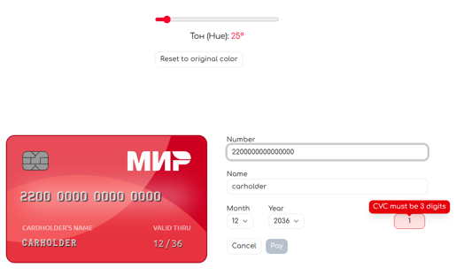

# React + TypeScript + Vite

# 💳 **Interactive 3D Payment Card Form**

> **Live Demo:** [https://bankcard3d.vercel.app](https://bankcard3d.vercel.app)

Профессиональный компонент формы оплаты с живой визуализацией банковской карты, глубокой валидацией и интеграцией с бэкендом.

## **🚀 Основные возможности (Features)**

- 3D Анимация и Визуализация:
  - Интерактивный разворот: Карта автоматически поворачивается на 180° при переходе к полю CVC и обратно.
  - Живой дисплей: Данные (номер, имя, дата) мгновенно отображаются на карте по мере ввода.
  - Эффект эмбоссирования (Embossed Text): Реалистичный объемный шрифт с тенями и светом, имитирующий настоящий пластик.
  - Динамические блики (Shine Effect): Анимированный перелив света на поверхности карты при наведении.
  - Glow-подсветка: Мягкое свечение активного поля на дисплее карты при фокусе в соответствующий инпут формы.

- Умная Валидация (TanStack Form + Zod):
  - Двойной стандарт: Поддержка карт на 16 и 19 цифр (МИР/Maestro).
  - Валидация "на лету": Проверка формата с задержкой (Debounce), чтобы не спамить ошибками во время печати.
  - Умные уведомления: Классические ошибки под инпутами и всплывающие Bubble-подсказки для узких полей (CVC).
  - Строгий контроль: Блокировка кнопки оплаты до полного соответствия всем правилам безопасности.
- Технологический стек и UX:
  - Синхронизация с Backend: Интеграция с Django REST Framework для безопасного расчета суммы по cart_code.
  - Масштабируемость: Использование CSS scale() для идеального отображения карты на любых мобильных устройствах (Responsive Design).
  - Безопасность: Использование криптограмм (CloudPayments/Tinkoff logic) — данные карты не хранятся в открытом виде на сервере.
  - Автоматизация: Автоматический перевод имени владельца в UPPERCASE и форматирование даты.

## 🎨 Advanced Theming:

- Full OKLCH color space integration.
- Real-time "Hue" slider that recalculates all 5 brand shades (Lighter to Darker) instantly.
- Persistent settings via LocalStorage.
